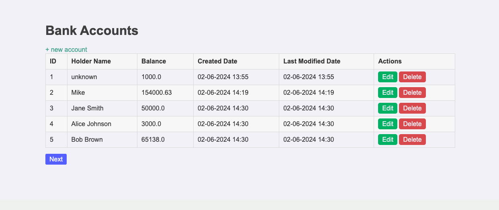

# Bank Account Management System
This project is a basic banking system developed with Spring Boot, Thymeleaf, and Spring Data JPA. It provides functionality for managing bank accounts, including creating, reading, updating, and deleting accounts. The project also handles exceptions, uses custom exceptions, and integrates pagination for displaying accounts.

## Dependencies Used

#### Spring Web: `spring-boot-starter-web`

Spring Web is used to build the web layer of the application. It provides features such as HTTP request handling, RESTful services, and web MVC framework for building robust and scalable web applications.

#### Spring Data JPA: `spring-boot-starter-data-jpa`

Spring Data JPA is used for data access in the application. It simplifies the implementation of data access layer by providing repositories and query methods for interacting with a database using JPA (Java Persistence API).

#### Thymeleaf: `spring-boot-starter-thymeleaf`

Thymeleaf is a modern server-side Java template engine for web and standalone environments. It is used for server-side rendering of HTML pages, allowing seamless integration of dynamic data into web pages.

#### H2 Database: `h2`

H2 Database is a lightweight, in-memory database that provides fast and reliable data storage for development and testing purposes. It is used in this project for its simplicity and ease of setup, making it ideal for rapid prototyping and development.

#### Lombok: `lombok`

Lombok is used to reduce boilerplate code in Java classes by automatically generating getter, setter, equals, hashCode, and toString methods during compilation. It helps improve code readability and maintainability by reducing the amount of repetitive code.

#### Spring Boot DevTools: `spring-boot-devtools`

Spring Boot DevTools is a set of tools that improve the development experience with Spring Boot applications. It provides features such as automatic application restarts, hot swapping of code changes, and enhanced development-time error reporting.

#### Validation: `spring-boot-starter-validation`

Validation is used to enforce data integrity and ensure that only valid data is accepted by the application. It helps prevent errors and inconsistencies in the data, improving the overall reliability and quality of the application.

#### Project Structure

Here's an overview of the project structure:
```
src
└── main
    ├── java
    │   └── com
    │       └── example
    │           └── banking
    │               ├── BankingApplication.java
    │               ├── controller
    │               │   └── AccountController.java
    │               ├── exception
    │               │   ├── AccountNotFoundException.java
    │               │   └── GlobalExceptionHandler.java
    │               ├── model
    │               │   └── Account.java
    │               ├── repository
    │               │   └── AccountRepository.java
    │               ├── service
    │               │   └── AccountService.java
    │               └── validation
    │                   └── AccountValidator.java
    └── resources
        ├── application.properties
        ├── templates
        │   ├── accounts.html
        │   ├── account_form.html
        │   └── error.html
        └── static
            └── css
                └── styles.css
```
### Screenshot


### Running the Application

Run the application using your IDE or by running the command `mvn spring-boot:run` in the terminal. Access the application at `http://localhost:8080/accounts`.

This project provides a basic banking system with CRUD operations, exception handling, pagination, validation, and a Thymeleaf-based UI.