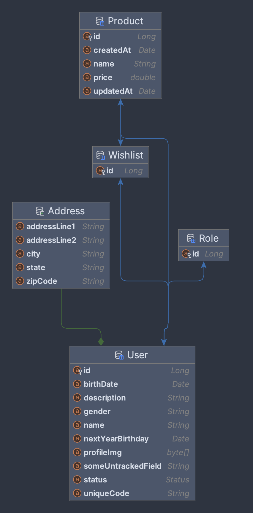

# Hibernate Practice
Hibernate a powerful object-relational mapping framework for Java applications. 
With this practice project, I learned how to map Java classes to database tables, establish relationships between entities, and utilize various Hibernate features such as entity lifecycle callbacks and data validation.

### Explanation of the Hibernate annotations
- `@Entity` and @Table: Marks the class as an entity and maps it to the table example_entity.
- `@Id` and @GeneratedValue: Specifies the primary key and its generation strategy.
- `@NaturalId:` Indicates a natural identifier for the entity.
- `@NotNull`, `@Size`: Validates that name is not null and has a size between 2 and 100.
- `@Lob`: Specifies that description should be persisted as a large object like binary files, images, or large text fields.
- `@Enumerated`: Maps the status enum to a string in the database.
- `@Temporal`: Specifies that birthDate should be persisted as a date.
- `@Transient`: Indicates that nonPersistentField should not be persisted.
- `@Formula`: Defines a derived property nextYearBirthday.
- `@OptimisticLock`: Excludes someUntrackedField from optimistic locking checks.
[//]: # ( Lifecycle callbacks)
- `@PreUpdate` annotated method updates the updatedAt field before the entity is updated.
- `@PostPersist` annotated method prints a message after the entity has been persisted.
- `@PostUpdate` annotated method prints a message after the entity has been updated.
- `@PreRemove` annotated method prints a message before the entity is removed.
- `@PostRemove` annotated method prints a message after the entity has been removed.
- `@PostLoad` annotated method prints a message after the entity has been loaded.

### Entity Mappings
- In the User entity, a @OneToMany annotation is utilized to establish a one-to-many relationship with the Product entity. This annotation designates the User entity as the owning side of the relationship, and it is mapped by the user attribute in the Product entity.
- Conversely, within the Product entity, a @ManyToOne annotation is employed to establish a many-to-one relationship with the User entity. This annotation specifies the foreign key column (user_id) in the Product table that references the primary key of the User table.
- Moreover, to facilitate wishlist functionality, an additional @OneToMany annotation is included in the User entity. This establishes a one-to-many relationship with the Wishlist entity, enabling each user to possess multiple wishlists. Correspondingly, within the Wishlist entity, a @ManyToOne annotation is utilized to establish a many-to-one relationship with the User entity, indicating that each wishlist belongs to a single user.



### Decision Criteria for DAOImpl:

Whether to use DAO implementations or not depends on your project requirements and preferences. Here are some considerations:
- Complexity: If your data access logic is straightforward, using DAO interfaces directly within services might suffice. However, for complex data access logic, implementing separate DAO classes can improve maintainability and separation of concerns.
- Flexibility: Using DAO implementations gives you more flexibility in terms of customization and optimization of data access logic.
- Testing: Separating DAO implementations can make unit testing easier, as you can mock DAO interfaces in your service tests.
- Code Organization: Using separate DAO implementations can lead to a cleaner code organization, especially in larger projects.

### Explanation of Caching Annotations:

Hibernate provides caching annotations that allow you to cache entity data for improved performance. Here are some commonly used caching annotations:

- `@Cacheable`: Indicates that entities should be cached. This annotation is applied at the entity level.
- `@Cache`: Specifies caching configuration options such as the cache region and expiration policy. This annotation is applied at the entity level.
- `@CacheConcurrencyStrategy`: Specifies the concurrency strategy for caching. This annotation is applied at the entity level and defines how the entity is cached and managed in a multi-threaded environment.

### Integration of Caching into the Project:

1. **Add Caching Annotations to Entities**:
   Apply `@Cacheable` and `@Cache` annotations to the entities you want to cache.

2. **Configure Caching Provider**:
   Configure the caching provider in your Hibernate configuration file (e.g., `hibernate.cfg.xml`).

    ```xml
      <property name="hibernate.cache.use_second_level_cache">true</property>
      <property name="hibernate.cache.region.factory_class">org.hibernate.cache.ehcache.EhCacheRegionFactory</property>
    ```

3. **Enable Caching**:
   Ensure that caching is enabled in your Hibernate configuration.

4. **Additional Considerations**:
    - Adjust caching settings such as expiration policies and cache regions based on your application's requirements.
    - Monitor cache usage and performance to optimize caching configurations.
